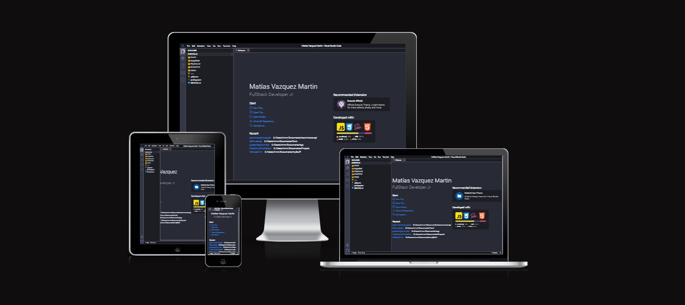

# VSCode Portfolio
Un sitio web con temática de Visual Studio Code construido con un solo HTML, SASS y JavaScript. Más que un clásico README, voy a contar los desafíos y progresos que atravesé replicando la estética y algunas funcionalidades de VSCode.

## 📚 Tech Stack 👨‍💻

**Cliente:**  

**Servidor:**  
 

**Dependencias:** Axios, Dotenv, Mongoose, Multer, Path, Socket.io.  
**Librerias:** Bootstrap Icons, SweetAlert2, HighlightJs, MarkedJs.

## 📃 Documentación 📑
### 🤔 ¿Por qué JavaScript y no un Framework?
En un principio cuando me surgió la idea, veía más viable el proyecto hacerlo con ReactJS, pero entonces se me manifestó un dilema. React me soluciona problemas que no entiendo el origen, y es por ello que decidí utilizar JavaScript y desafiarme a crear mis propios componentes y clases.
### 🎨 Color Reference
En la selección de colores me basé en mi tema que uso a diario en mi VSCode, Drácula.

| Color             | Hex                                                                |
| ----------------- | ------------------------------------------------------------------ |
| Background |  #282A36 |
| Secondary Background |  #1d1e24 |
| Grid Border |  #44475a |
| Font Color |  #f0f8ff |
| Comment |  #6272a4 |
| Pink |  #ff79c6 |
| Purple |  #bd93f9 |

### 🔲 Layout
El layout principal del sitio utilicé Grid, y me ayudé con una página, [Layouit!](https://grid.layoutit.com/) que me parece muy útil para los que no somos expertos en CSS. Después en cada componente empleé Flexbox que estoy más familiarizado.
### 📱 Responsive
Muy probable que esta versión, todavía no este 100% óptima para adaptarse a todos los dispositivos. Estaré trabajando en ello.

## 🔎 Explorer
### 📁 "Assets"
En el sidebar donde se representa la raíz de carpetas, assets fue la primer función que hice para renderizar en la principal vista. Sencilla, pero eficaz, espero que sean de su agrado los memes 😅.
### 📝 "PlayGround"
No sería un IDE si no se puede programar algo. Aunque no tiene ninguna función extra como indentación, resaltar la sintaxis o autocompletado, cumple su objetivo. Próximamente, estaré investigando como integrar todo eso con NodeJs y CodeMirror.
## 📚 Stack

### 📦 "Installed"
Las tecnologías que están en esta sección son las que estoy familiarizado, conozco su utilidad y su sintaxis, no quiere decir que las controle de principio a fin. En el futuro, estoy dispuesto a aprender a manejarlas, aunque entiendo que no es posible llegar a un dominio total de ellas.
### 📖 "Next To Learn"
Como están presentadas, es el orden esperado a aprenderlas. Por lo que no hice el portfolio en React, es la misma razón que sigo controlando Express y no NestJs. El aprendizaje no es de un día para el otro, es un proceso donde hay que disfrutar las pequeñas victorias. 
## ⭐ Bookmarks
### 📌 "Favorite"
Básicamente, están los sitios web que utilice de ayuda para construir el portfolio, y además otros sitios que me parecen interesante de compartir. Continuaré añadiendo más a medida que los descubra.
### 📼 Recommended Channels
Con la misma idea que "Favorite", solo que en esta sección comparto los canales de YouTube que consumo a diario y que considero que brindan buen material.  
Lo interesante de esta sección, es que consumo la api YouTube Data V3 para la información de los canales. Debido a la cantidad de datos que solicito, cumplía la cuota de peticiones diaria en un lapso corto, por ende cree un archivo JSON que funciona como una memoria cache donde se almacena una copia de las respuestas. Este archivo se actualiza cada 24 horas, ya que la información no va a variar demasiado en ese tiempo.
## 📞 Contact
A pesar de su aparente simplicidad como una presentación de mis redes de contacto, su creación resultó más desafiante de lo esperado. Estoy satisfecho con el resultado final, que se asemeja a la estructura de un archivo JSON.
## 🐱 Github
En esta sección, del lado del backend, cree una capa servicio que se encarga de administrar el caché. Es la que se responsabiliza de realizar una copia de las peticiones a la API pública de Github y almacenar en un archivo JSON. Esta capa también se utiliza en Bookmarks para las consultas a la API de YouTube.
## 🏆 Logros
En este proyecto, enfrenté numerosos desafíos y experimenté momentos de frustración. Sin embargo, me siento orgulloso de los logros que alcancé, especialmente en el ámbito del frontend, donde tuve la oportunidad de diseñar completamente el sistema de pestañas desde cero. Muy contento con el resultado obtenido. 
Y mi otro gran logro en el lado del Backend, fue implementar el patrón strategy que se encarga de intercambiar la persistencia de los datos en tiempo de ejecución en CRUD.