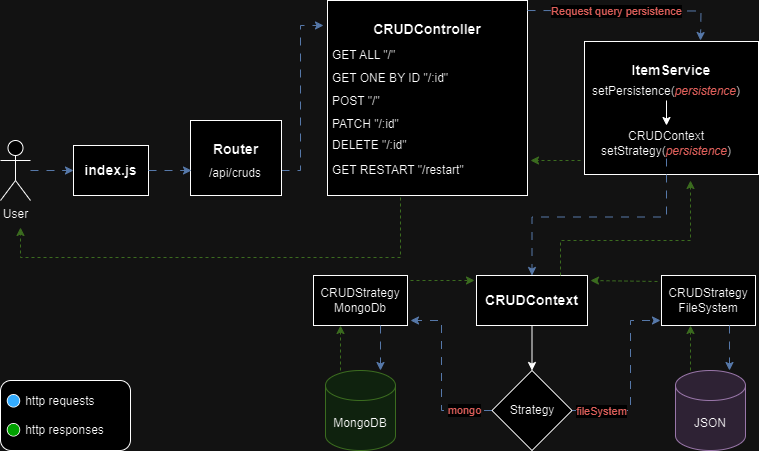

# API de Administración CRUD con Almacenamiento Dinámico 

Esta API facilita las operaciones CRUD (Crear, Leer, Actualizar, Eliminar) sobre datos, ofreciendo la flexibilidad de elegir entre el uso de una base de datos MongoDB o un archivo JSON para el almacenamiento. La implementación incorpora el patrón de diseño Strategy, permitiendo cambiar el método de persistencia en tiempo de ejecución.





## API Reference
*respuestas MongoDb

#### Get all items

```http
  GET /api/cruds?persistence=mongodb
```

```json
Response:
{
    "status": "success",
    "message": "Items found",
    "payload": [
        {
            "_id": "6537191ad540729aaa2106a2",
            "title": "prueba2",
            "description": "description 2",
            "category": "category 2",
            "image": "https://dummyimage.com/300x200/000/fff",
            "price": 99,
            "stock": 99,
            "status": true,
            "__v": 0
        },
        ...
    ]
}
```

#### Get one item by id

```http
  GET /api/cruds/:id?persistence=mongodb
```
```json
Response:
{
    "status": "success",
    "message": "Item find",
    "payload": {
        "_id": "6537191ad540729aaa2106a1",
        "title": "prueba1",
        "description": "description 1",
        "category": "category 1",
        "image": "https://dummyimage.com/300x200/000/fff",
        "price": 99,
        "stock": 99,
        "status": true,
        "__v": 0
    }
}
```

#### Create new item

```http
  POST /api/cruds?persistence=mongodb
```
```http
Request body:
{
    "title": "prueba",
    "description": "description",
    "category": "category",
    "image": "img.jpg",
    "price": 99.99,
    "stock": 99
}
```
```json
Response:
{
    "status": "success",
    "message": "Item find",
    "payload": {
        "_id": "6537191ad540729aaa2106a1",
        "title": "prueba1",
        "description": "description 1",
        "category": "category 1",
        "image": "https://dummyimage.com/300x200/000/fff",
        "price": 99,
        "stock": 99,
        "status": true,
        "__v": 0
    }
}
```

#### Modify existing item
```http
  PATCH /api/cruds/:id?persistence=mongodb
```
```http
Request body:
{
    "title": "PRUEBA MODIFICACION"
}
```
```json
{
    "status": "success",
    "message": "Item successfully modified",
    "payload": {
        "_id": "6537191ad540729aaa2106a1",
        "title": "PRUEBA MODIFICACION",
        "description": "description 1",
        "category": "category 1",
        "image": "https://dummyimage.com/300x200/000/fff",
        "price": 99,
        "stock": 99,
        "status": true
    }
}
```

#### Delete by id
```http
  DELETE /api/cruds/:id?persistence=mongodb
```
```json
Response:
{    
    "status": "success",
    "message": "Item deleted successfully",
    "payload": {
        "_id": "6537191ad540729aaa2106a1",
        "title": "prueba1",
        "description": "description 1",
        "category": "category 1",
        "image": "https://dummyimage.com/300x200/000/fff",
        "price": 99,
        "stock": 99,
        "status": true,
        "__v": 0
    }
}
```

#### Restart data
```http
  GET /api//cruds/restart?persistence=mongodb
```
```json
{
    "status": "success",
    "message": "Items restart to orinal file",
    "payload": []
}
```


